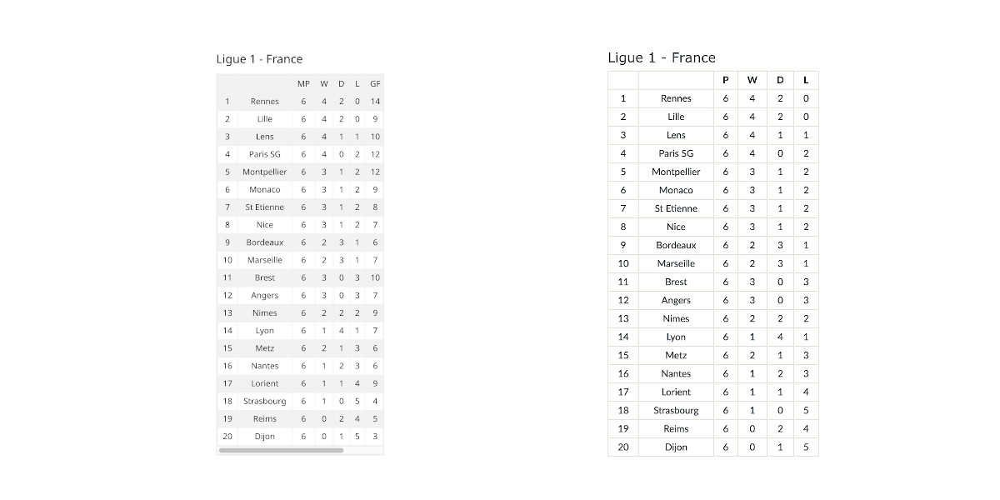

# Reddit Football Sidebar

Displays football data in the sidebar from apifootball.com.

### Instructions

-   Install requirements `pip install -r requirements.txt`
-   Create Reddit (script) app at <https://www.reddit.com/prefs/apps/> and get keys
-   Get an API key from <https://apifootball.com/>
-   Edit conf.ini with your details
-   Create a new subreddit wiki page with the title you chose in conf.ini
-   Edit old Reddit stylesheet at <https://old.reddit.com/r/SUBREDDIT/about/stylesheet/> and add this CSS

        .side table {
          width: 100%;
        }

        .wiki-page-content table {
          width: 80%;
        }

-   Add a new text widget on the new Reddit style at <https://new.reddit.com/r/SUBREDDIT/?styling=true>, name it `Football` (or whatever you declared it to be in conf.ini) and add some dummy text

-   Run it `python run.py`

### Settings Info

`reddit_user` - Reddit username  
`reddit_pass` - Reddit password  
`reddit_client_id` - Reddit Client ID  
`reddit_client_secret` - Reddit Client Secret  
`reddit_target_subreddit` - Subreddit to update sidebar  
`reddit_widget_name` - Widget name (new Reddit style)  

`football_api_key` - API key from apifootball  
`football_league_ids` - League ids to get can be a list e.g. 123,124,125  
`football_wiki_page` - Wiki page to populate

### Notes

-   The account that you use for the bot has to be a mod of the target subreddit and have the correct permissions to edit things.
- The script only runs once. You can run it on https://www.pythonanywhere.com/ once a day for free.

### Tip

BTC - 1AYSiE7mhR9XshtS4mU2rRoAGxN8wSo4tK
